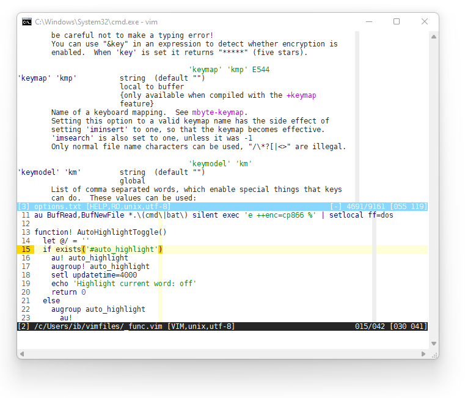

# Basic custom setting VIM/GVIM



Clone the repository with submodules(!) to the "~ / .vim" or "% USERPROFILE% \ vimfiles" folder (depending on your platform):

```
$ mkdir .vim
$ git clone --recursive https://bigov@github.com/bigov/vim_base.git .vim
```

Using custom TTF font: "DejaVu Sans Mono for Powerline".

Customized keyboard shortcuts can be found in the "_keys.vim" file.

