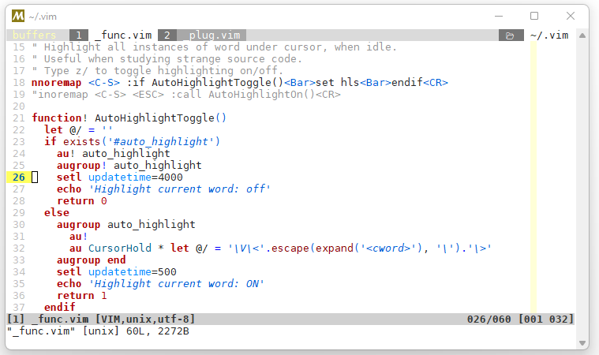
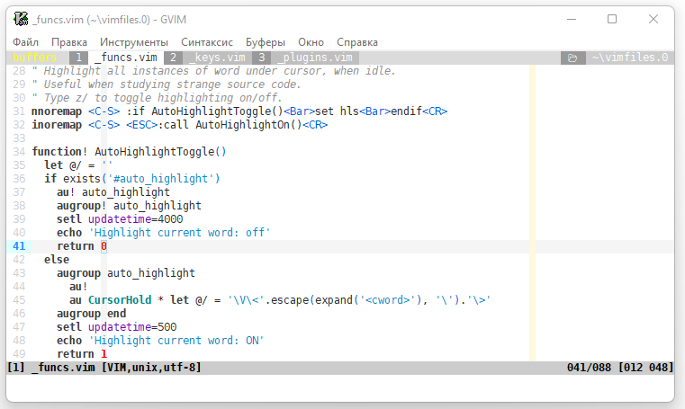

# Basic custom setting VIM/GVIM

Download the contents of the repository to the

  "~ / .vim" or "% USERPROFILE% \ vimfiles"

folder (depending on your platform);

Using custom TTF font: "DejaVu Sans Mono for Powerline".

Customized keyboard shortcuts can be found in the "_keys.vim" file.

